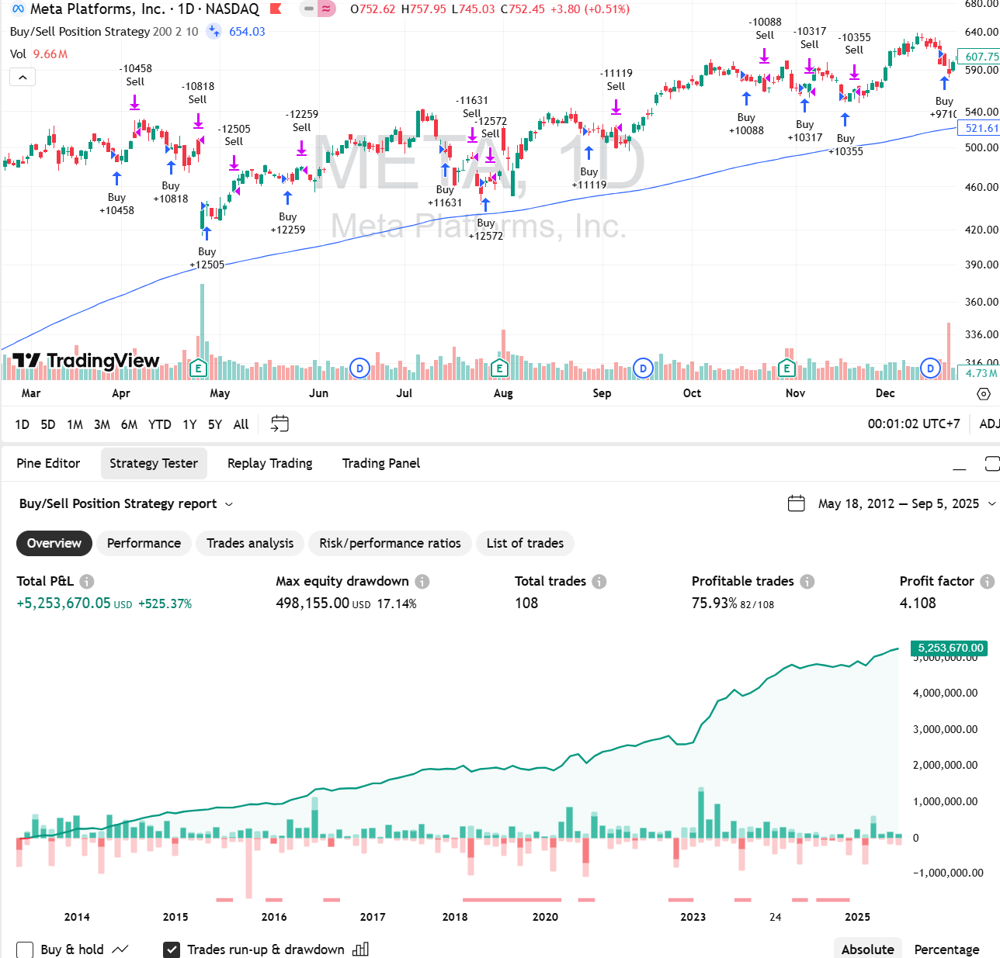
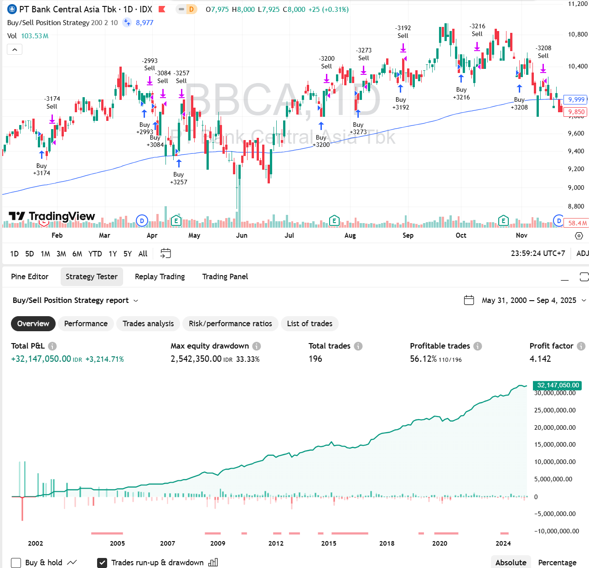

# RSI-2 Stock Trading Strategy Pinescript Version
This is a PineScript version of the previously uploaded strategy on Python [here](https://github.com/handiko/RSI-2-Stock-Trading-Strategy/blob/main/README.md)

---

This repository contains a simple, yet robust, Pine Script trading strategy designed for use on TradingView. The strategy combines two popular technical indicators—a long-term Exponential Moving Average (EMA) for trend identification and a short-term Relative Strength Index (RSI) for entry signals—to manage buy and sell positions.

## Strategy Overview
This strategy is built on a core idea: trade the trend while exploiting short-term oversold conditions. It uses the following logic:
* **Trend Identification:** A 200-period EMA acts as a trend filter. The strategy will only consider entering a long position if the current price is above this long-term average, indicating an established uptrend.
* **Entry Trigger:** The strategy waits for the 2-period RSI to drop below a user-defined level (default is 10). This short-term oversold condition suggests a potential pullback within the existing uptrend, providing a low-risk entry point.
* **Position Management:** An internal state variable ensures that the strategy holds only one position at a time, preventing multiple entries.
* **Exit Condition:** A position is closed when the price shows a strong momentum to the upside, specifically when today's closing price exceeds yesterday's high. This acts as a simple but effective profit-taking mechanism.

## Technical Breakdown
The code is well-structured and uses several key Pine Script features to manage its state and logic effectively.

**1. State Management with** var
The most critical technical element is the use of var int positionState = 0. Unlike a regular variable, a var variable retains its value from one bar (or candle) to the next. This is essential for the strategy's logic, as it allows the code to remember whether a position is currently open (positionState = 1) or closed (positionState = 0). This prevents the strategy from continuously buying on every bar that meets the entry conditions.

**2. Customizable Inputs**
The strategy is highly customizable via the input.int() function:
* maLength: Controls the period of the Exponential Moving Average (default: 200).
* rsiLength: Adjusts the period of the Relative Strength Index (default: 2).
* rsiLevel: Sets the oversold level for the RSI entry signal (default: 10).

**3. Logical Conditions**
The entry and exit logic are broken down into clear, readable Boolean variables:
* **Buy Signal** (buySignal): The strategy only enters a trade if all three conditions are met: the price is above the 200 EMA (isAboveMA), the 2-period RSI is below the set level (isRSIBelowLevel), and there is currently no open position (isInNoPosition).
* **Sell Signal** (sellSignal): The exit logic is triggered only when there is an open position (isInBuyPosition) and the close price exceeds the previous bar's high (isCloseHigherThanYesterdayHigh). This simple momentum-based exit aims to capture gains during strong upward movements.

**4. Strategy Commands**
The core trading actions are performed using built-in Pine Script strategy functions:
* strategy.entry("Buy", strategy.long): This command opens a long position with the label "Buy" when the buySignal is true.
* strategy.close("Buy", comment="Sell"): This command closes the open "Buy" position and adds a comment "Sell" to the trade history.

**5. Visual Plotting**
The script also plots the 200-period EMA directly on the chart using the plot() function, allowing for visual confirmation of the trend filter.

## How to Use
1. Copy the entire Pine Script code block from this file.
2. Open TradingView and navigate to the Pine Editor.
3. Paste the code into the editor.
4. Click "Save" and then "Add to Chart" to apply the strategy to your preferred ticker.

## Disclaimer: 
**_This is a trading strategy for educational and illustrative purposes only. Trading involves risk, and past performance is not indicative of future results. Always backtest and paper trade any strategy before using it with real capital._**

## Examples
### Meta Platforms (Facebook)

### Bank BCA 

---

## Related Projects
* [RSI-2 Stock Strading Strategy](https://github.com/handiko/RSI-2-Stock-Trading-Strategy/blob/main/README.md)
* [Portfolio Trading Strategy Backtester](https://github.com/handiko/RSI-2-Portfolio-Trading-Strategy-Backtester/blob/main/README.md)

---

Back to [Index](https://github.com/handiko/handiko/blob/master/README.md)
